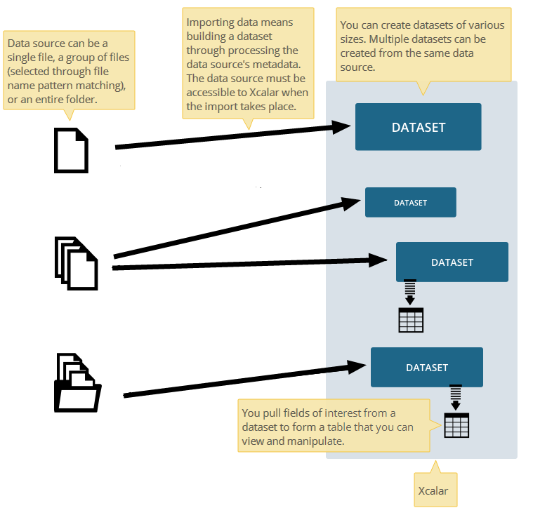

Key Concepts
=============

To use the Xcalar SDK effectively, you should understand some of the key concepts
and terminology. This page provides an overview of key terms and concepts
that apply to Xcalar. These are consistant with those found in Xcalar Design.

.. raw:: html

    <h3>Data Sources</h3>

The raw data you want to analyze can be stored in one file, or multiple files
in the same directory or different directories. The term "data source" refers
to the file, files, or directory containing the raw data. For example, your
data source can be an HDFS file system that your Xcalar nodes can access or
a file system NFS-mounted on each node of the cluster.

.. raw:: html

    <h3>Data Targets</h3>

Xcalar can import data from various storage platforms, be they in the cloud or on-premises.
When you import data, you must provide information about the storage location and the
method used by your Xcalar instance to access the location. A data target contains the
specifications of the storage location and the access method. At the time of importing
data, you specify a path on a data target, and the file or files specified will be processed into
Xcalar according to the specifications. Xcalar provides a predefined
data target, but you can add additional ones.

For example, your data target can be a Microsoft Azure Storage Account, an Amazon Simple
Storage Service (S3) account, or an NFS-mounted file system on your Xcalar cluster.
Depending on the target type, Xcalar accesses the files by using the authentication
method described in the target.

.. raw:: html

    <h3>Datasets</h3>

Through reading the data at its source, Xcalar obtains the metadata to build a dataset.
This process of reading the data and building the dataset is called importing a data source.
Once in Xcalar, datasets are the starting point for shaping, cleansing and enriching your
data for creating models.

.. raw:: html

    <h3>Tables</h3>

After you import data from a data source, you can pull fields of interest from the dataset
to create tables in a Xcalar Design worksheet. More fields from the dataset can be added
to an active table at any time.

In Xcalar Design You can manipulate and transform data within a table (for example, by
sorting or filtering) or manipulate multiple tables, which can be in different worksheets,
to create a new table (for example, by joining). This functionality cannot be achieved
with the SDK, yet.

The following diagram illustrates the relationships among data sources, datasets, and tables.

.. raw:: html

    <h3>Dataflows</h3>

While working with tables in Xcalar Design, Xcalar is generating a dataflow graph that captures the
transformations performed on table data. Each dataflow graph provides an audit trail for
your data. It helps you trace data lineage through all stages of your analytics pipeline.
Over time, the data in your table might become increasingly complex due to the operations
performed on the table.

It is useful to view the dataflow graph in Xcalar Design to visualize how the data has been
transformed since the table was created. For example, you can determine when a value in a
column was filtered out or what operation was used to create a particular column.

.. raw:: html

    <h3>Workbooks</h3>

You can create workbooks in Xcalar, which can be regarded as files. Within a
workbook, you can create as many tables as you want. The relationship between a
table and a workbook is similar to the relationship between a Microsoft Excel
table and workbook.

.. raw:: html

    <h3>User Defined Function (UDF)</h3>

User Defined Functions are code that users can write to extend the functionalities of Xcalar.
User Defined Functions are scheduled and executed in Xcalar Processing Units.
